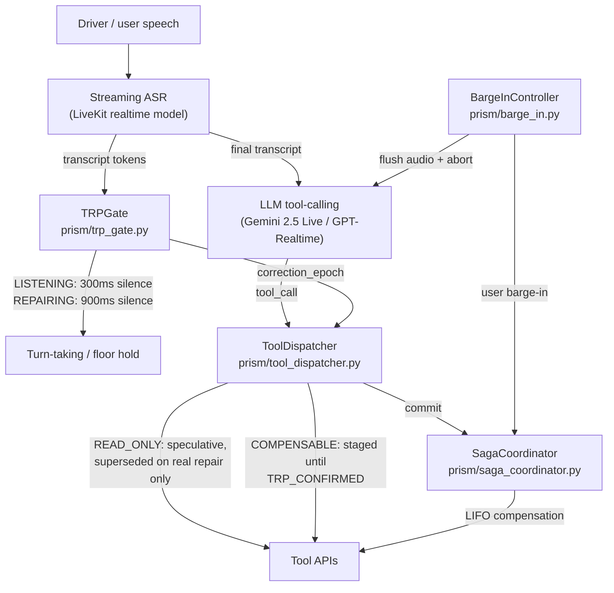
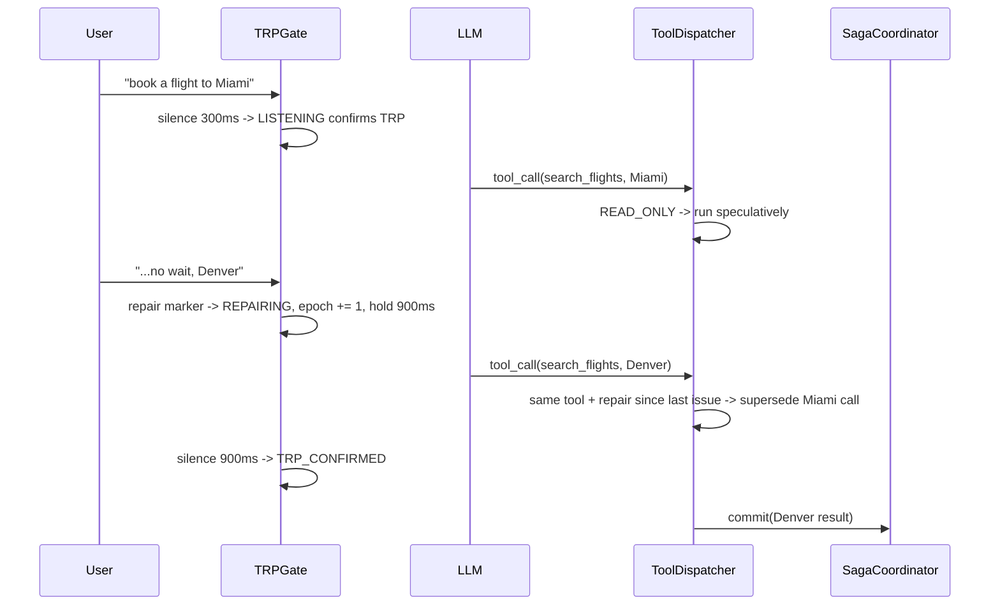
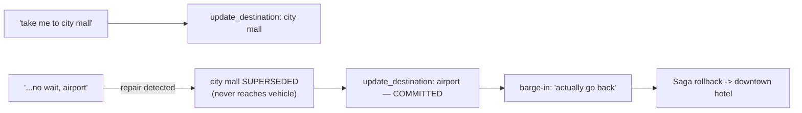
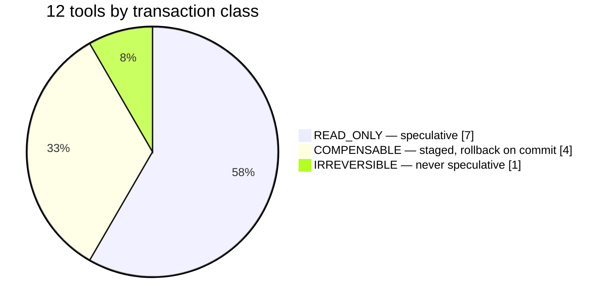

# TRAX: Transactional Real-time Agent eXecution

**Full Title:** TRAX: Voice-Native Interruptible Real-Time Agent Architecture

**Context / Program:** Samsung PRISM GenAI Hackathon 3.0 — Theme 05: Interruptible Real-Time Agents

**Core Focus:** Disfluency-aware turn gating (TRPGate) and speculative, compensable
two-phase tool execution for full-duplex streaming voice assistants.

---

## 1. What this is

Standard voice agents run tool calls the instant a VAD detects a pause. If the user was
mid-correction ("book a flight to Miami... no wait, Denver"), that pause-triggered call
already fired on the stale value — and a naive agent has no way to tell "the user is done
talking" from "the user is about to fix what they just said."

TRAX gates tool execution on a **linguistic** repair signal instead of a purely acoustic
one, and wraps every tool call in a transactional model so a stale or superseded call can be
dropped or rolled back cleanly, never executed twice, and never lost when it was legitimate.
It adapts ideas from Atomix's effect taxonomy (`READ_ONLY` / `COMPENSABLE` / `IRREVERSIBLE`)
and Saga-pattern compensation (Garcia-Molina & Salem, 1987) to real-time voice turn-taking
(Levelt, 1983's model of self-repair). Full literature review: [RESEARCH.md](RESEARCH.md).

## 2. Architecture



**Turn lifecycle** — what happens between one user utterance and the next:



**Core package (`prism/`):**

| Module | Role |
|---|---|
| `prism/trp_gate.py` | Detects genuine self-correction (Levelt editing markers) at clause boundaries, not on bare words like "no"/"rather" anywhere in a sentence. Holds the floor with a dynamic silence threshold during a repair. Exposes `correction_epoch`, a monotonic count of real repairs. |
| `prism/tool_dispatcher.py` | Two-phase transactional tool execution. `READ_ONLY` calls run speculatively; `COMPENSABLE` calls stage until the turn is confirmed; a same-tool call is only superseded when a real repair happened in between (via `correction_epoch_fn`) — so two legitimate calls to the same tool (e.g. tracking two different orders) both survive instead of the second one silently discarding the first. |
| `prism/saga_coordinator.py` | LIFO compensation ledger for committed mutations (Saga pattern) — a barge-in after commit rolls back cleanly instead of leaving stale state. |
| `prism/barge_in.py` | Detects the user talking over the agent, flushes output audio, triggers rollback via the Saga coordinator. |

**Live agent entrypoint:** `agent/trax_agent.py`, launched via `python -m agent.run dev` /
`start` (see `agent/run.py`). `agent/prism_agent.py` is an earlier implementation kept only
because `prism/tests/test_turn_lifecycle.py` still imports three helper classes from it
(`LatencyTracker`, `SilenceTicker`, `TurnLifecycleCoordinator`) — if you're reading the agent
code for the first time, read `trax_agent.py`.

**Shared prompt/tool source:** `agent/tool_specs.py` — the single place the system prompt and
tool schemas are defined, so nothing else in the repo can silently drift from it.

## 3. Extension use case — clearly marked

**`agent/extension_incar.py`** — an in-car voice navigation agent, entirely outside the
travel/finance/housing/e-commerce tool set above. A driver changes their destination
mid-route ("take me to the city mall... no wait, actually the airport") and the same TRAX
stack protects a live, stateful vehicle action:

- `TRPGate` holds the floor while the driver corrects themselves.
- `ToolDispatcher` (via a small `InCarDispatcher` subclass) never lets the stale destination
  reach the vehicle; last-writer-wins on `update_destination`.
- `SagaCoordinator` remembers the previous route so a barge-in can roll it back.
- `BargeInController` (via `InCarBargeIn`) rolls back only on a real correction, not a
  backchannel acknowledgement ("okay, thanks").

Nothing under `prism/` is modified to support this — it's the same transactional core, reused
in a second domain, which is the point: the architecture generalizes.



Run it (no API keys needed for the offline path):
```bash
python -m agent.extension_incar --demo   # deterministic offline walkthrough
python -m unittest prism.tests.test_extension_incar -v
python -m agent.extension_incar dev      # live LiveKit voice agent (needs .env)
```
Verified for this document: **the offline demo runs end-to-end, all 8 verification checks
pass** (superseded stale call, committed correction, both barge-ins flushed audio, rollback
to the correct prior destination, post-barge command applied, acknowledgement barge-in
correctly did *not* roll back, exact mutation history, and a read-only query's stale call
correctly superseded).

## 4. Tool transaction classes

Verified against the live `EFFECT_MAP` in `prism/tool_dispatcher.py`, not just read from
source:



| Tool | Class | Rollback on Saga compensation |
|---|:---:|---|
| `search_flights`, `get_exchange_rate`, `get_card_benefits`, `search_apartments`, `calculate_commute`, `search_products`, `track_order` | `READ_ONLY` | n/a — no side effect |
| `book_flight` | `COMPENSABLE` | Cancel reservation |
| `modify_autopay` | `COMPENSABLE` | Revert funding source |
| `update_search_filter` | `COMPENSABLE` | Restore prior filter |
| `add_to_cart` | `COMPENSABLE` | Remove item |
| `update_identity_doc` | `IRREVERSIBLE` | None — government document mutation, never run speculatively |

Any tool not in this list fails **closed**: treated as `COMPENSABLE` (staged, not run
speculatively) rather than assumed safe — see `UNKNOWN_DEFAULT` in `prism/tool_dispatcher.py`.

## 5. Setup and run steps

**Requirements:** Python 3.10+, a free [LiveKit Cloud](https://cloud.livekit.io) account, and
either a Google API key (Gemini, default provider) or an OpenAI API key (GPT-Realtime).

```bash
python -m venv .venv && source .venv/bin/activate
pip install -e .
```

**Environment variables** — create a `.env` file at the repo root (never commit it):

| Variable | Required when | Read by |
|---|---|---|
| `LIVEKIT_URL`, `LIVEKIT_API_KEY`, `LIVEKIT_API_SECRET` | Always, to run any live agent | `agent/trax_agent.py` |
| `LK_PROVIDER` | Optional, default `gemini2_5` | `agent/trax_agent.py` (`gemini2_5` or `gpt_realtime`) |
| `GOOGLE_API_KEY` | If `LK_PROVIDER=gemini2_5` | `agent/trax_agent.py` |
| `OPENAI_API_KEY` | If `LK_PROVIDER=gpt_realtime` | `agent/trax_agent.py` |

> No `.env.example` is checked into this repo, and `.gitignore`'s `.env.*` line would
> silently exclude one if added as-is (needs a `!.env.example` exception line after it).
> Build your local `.env` from the table above.

**Run the unit tests:**
```bash
python -m unittest discover -s prism/tests -p "test_*.py" -v
```

**Run the live agent:**
```bash
python -m agent.run dev     # or: start
```

**Compliance check** (run after any prompt edit — checks tool descriptions don't contain
verbatim answers to public benchmark scenarios):
```bash
python scripts/audit_benchmark_leakage.py --files agent/trax_agent.py agent/tool_specs.py agent/extension_incar.py
```

## 6. Anti-overfitting

- The repair lexicon (`prism/trp_gate.py`) is derived from Levelt's (1983) general
  psycholinguistic model of speech repair, not fitted to any specific test data.
- `scripts/audit_benchmark_leakage.py` scans tool descriptions and prompts for verbatim
  overlap with public benchmark answers, so illustrative examples can't accidentally become
  answer keys.
- The transactional core (`prism/`) has no domain-specific logic in it at all — §3
  demonstrates this directly by reusing it, unmodified, in a second domain (in-car
  navigation) with a different tool set entirely.